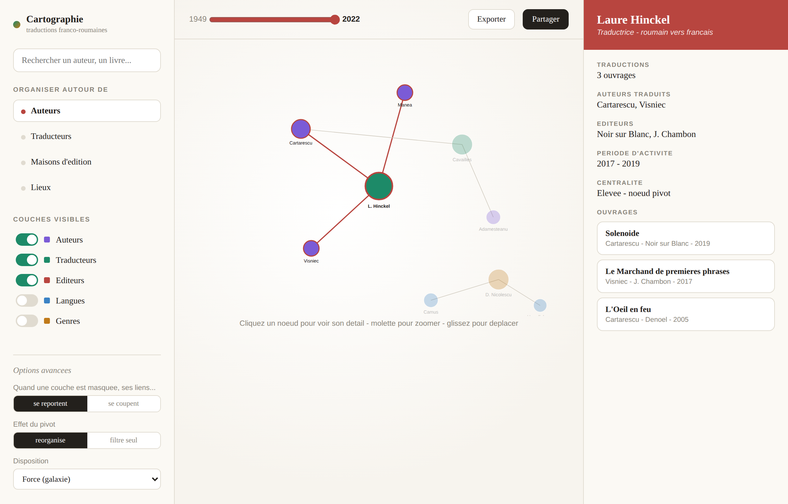

# Cartographie interactive de métadonnées

Transforme un **tableur Excel** de métadonnées (livres, parutions, traductions…)
en une **cartographie en réseau** explorable : les entités (auteurs, traducteurs,
éditeurs, langues, lieux…) deviennent des nœuds, reliés selon les ouvrages qu'ils
partagent. On explore, filtre, recompose et **exporte** la carte (image nette pour
Word, GEXF pour Gephi, CSV/XLSX).

L'outil est **générique** : il ingère n'importe quel `.xlsx` de structure
raisonnable, détecte les colonnes, propose des rôles, et laisse tout ajuster.
Principe directeur : *ne rien figer qui puisse être rendu réglable.*



---

## Lancer en local

Prérequis : **Python 3.11+** (testé sur 3.14).

### Windows (PowerShell)

```powershell
py -3 -m venv .venv
.\.venv\Scripts\Activate.ps1
pip install -r requirements.txt
uvicorn backend.main:app --reload
```

### macOS / Linux

```bash
python3 -m venv .venv
source .venv/bin/activate
pip install -r requirements.txt
uvicorn backend.main:app --reload
```

Puis ouvrez **http://127.0.0.1:8000/**. Le même serveur sert l'API *et* le frontend.

> Cliquez **« Charger le fichier de démonstration »** pour partir des traductions
> franco-roumaines fournies (`data/traductions_demo.xlsx`), ou déposez votre propre
> `.xlsx`.

### Tests

```bash
pip install -r requirements-dev.txt
pytest
```

Couvre l'ingestion/profilage, le graphe maître et les projections (report/cut,
regroupement, garde-fous), et l'API de bout en bout (configure, graphe, fiche,
métriques, exports). Garde-fous serveur : sessions plafonnées (éviction LRU),
taille d'upload limitée, métriques mises en cache par vue.

---

## Comment ça marche (en 4 temps)

1. **Dépôt** — vous déposez un `.xlsx`. Le backend lit chaque colonne, mesure son
   type et son **taux d'unicité**, et **suggère un rôle**.
2. **Rôles** — chaque colonne reçoit un rôle, modifiable à tout moment :
   - **Nœud** — la colonne devient un type d'entité affiché (chaque valeur = un nœud).
   - **Lien** — relie les nœuds sans être affichée (typiquement le *titre*, qui relie
     auteur ↔ traducteur ↔ éditeur d'une même ligne).
   - **Info** — enrichit la fiche d'un nœud (année, genre, lieu…), sans peser sur le graphe.
   - **Ignoré** — non utilisée.

   Le même champ peut être nœud, lien ou info selon le choix → **des cartes
   différentes depuis la même donnée**. Vous nommez aussi ici **l'unité qui relie
   les entités** (une ligne du tableur) : *objet* par défaut, ou un mot dérivé du
   nom de la feuille (« traduction », « film »…). Ce nom s'affiche partout —
   interface et exports. Et si plusieurs lignes décrivent la **même chose** (ex. un
   livre en VO et sa traduction), vous pouvez choisir une colonne de
   **regroupement** : ces lignes fusionnent alors en **une seule charnière**.
3. **Graphe maître** — un seul graphe complet est construit (toutes les entités +
   la ligne comme nœud-charnière). Il ne change plus.
4. **Exploration** — tout l'affichage est une **projection** de ce graphe, calculée à
   la volée : masquer une couche, changer de pivot, masquer la charnière, filtrer par
   année — instantané, **sans reconstruire** le graphe.

> Pour le détail du fonctionnement, des technologies et de la méthodologie, voir
> **[docs/fonctionnement.md](docs/fonctionnement.md)**.

---

## Ce qu'on peut régler

> **Terminologie** — le réseau relie les entités via une *ligne* du tableur. Son
> nom est réglable (défaut *objet*, ou dérivé du nom de la feuille). Cette doc,
> écrite autour de la démo de traductions, l'appelle souvent « ouvrage » : c'est
> juste l'exemple, choisissez le vôtre via **Nom d'une ligne**.

| Contrôle | Effet |
|---|---|
| **Recherche** | filtre / centre sur les nœuds correspondants |
| **Nom d'une ligne** | comment appeler l'unité qui relie les entités (ex. *livre*, *film*, *traduction*) — *objet* par défaut, ou dérivé du nom de la feuille ; apparaît dans toute l'interface et les exports |
| **Regrouper les lignes par** | fusionne les lignes partageant un identifiant commun en **une seule charnière** (ex. VO + traduction d'une même œuvre) — relie sans nœud-identifiant parasite |
| **Organiser autour de** (pivot) | *réorganise* (le pivot influence la disposition) ou *filtre seul* (centre/met en évidence) |
| **Couches (3 états)** | **toute** colonne non-ignorée (entité, titre, info, année) cycle, **sans reconfigurer**, entre *affiché* (nœud visible), *relie* (invisible mais connecte — la « lentille ») et *hors* (exclu). Le rôle ne donne que le défaut. Permet d'explorer « auteurs reliés via traducteur » puis « via genre » à la volée — y compris **afficher** un genre/lieu comme points |
| **Survol d'une arête** | info-bulle expliquant **pourquoi** deux nœuds sont reliés (ouvrages communs + intermédiaires partagés, ex. *via le traducteur X*) |
| **(nom choisi) (charnière)** | affiche les lignes comme nœuds-charnières, ou les garde implicites *(le libellé suit le nom choisi)* |
| **Liens d'une couche masquée** | *se reportent* (projection : on relie les voisins entre eux) ou *se coupent* |
| **Couleur des nœuds** | par **type** d'entité, par **communauté** (Louvain), ou par **époque** (année moyenne d'activité → dégradé, avec légende) |
| **Taille des nœuds** | par centralité : degré, intermédiarité, vecteur propre |
| **Disposition** | force (galaxie), **temporel** (axe horizontal = temps), circulaire, dispersée |
| **Densité des étiquettes** | toutes / pivots / aucune |
| **Affichage** | *automatique* (points → étiquettes → cartes selon le zoom), *toujours points*, *toujours cartes* — plus **épinglage** d'une carte sur un nœud |
| **Champs de la carte** | au zoom rapproché, choisir les infos affichées sur la carte d'une charnière/ligne (auteur, traducteur, année, genre…) — réglable à la volée |
| **Curseur temporel** | ne montre que les ouvrages (et entités/liens dérivés) dans la plage d'années — les positions restent stables |
| **Frise / histogramme** | sous le curseur, le nombre d'ouvrages par année ; cliquer/glisser dessus ajuste la plage |
| **Lecture animée** | bouton ▶ qui balaie le temps (play / pause / vitesse) — le réseau se construit année après année, sans recalcul des positions |
| **Filtre temporel** | *cumulatif* (borne basse + borne haute libres) ou *fenêtre glissante* (tranche de largeur fixe qu'on fait défiler — combinée à la lecture animée) |
| **Instantanés** | une grille de mini-réseaux à des périodes successives (mêmes positions de nœuds) pour comparer les époques — exportable en PNG 300 DPI + SVG |
| **Chronologie** | vue alternative : une ligne par entité du pivot, ses ouvrages placés dans le temps (point par ouvrage, trait de durée d'activité, couleur par attribut au choix) — exportable PNG + SVG |
| **Réseau temporel** | disposition où l'axe horizontal = le temps (X = année moyenne, Y anti-collision, taille = nombre d'ouvrages, liens conservés), axe des années affiché — exportable PNG + SVG |

**Niveaux de détail** : dézoomé = points colorés ; zoom intermédiaire = points +
étiquettes ; zoom rapproché = petites **cartes** (titre + 2-3 infos).

**Clic sur un nœud** → son voisinage s'illumine, le reste s'estompe, et le panneau de
droite montre ses attributs, ses statistiques (centralité, communauté) et ses ouvrages.

---

## Export (orienté Word)

Bouton **Exporter** :

- **Image** : **PNG 300 DPI** (défaut), **SVG** vectoriel, ou **PDF** — dimensions
  (pleine page / colonne / carré) et densité d'étiquettes réglables. Le rendu
  *correspond exactement à l'écran* : les positions courantes sont envoyées au backend
  qui redessine la vue avec matplotlib (mêmes positions, couleurs, clusters, filtres).
- **Périmètre** : vue courante (filtres actifs) ou voisinage du nœud sélectionné (N sauts).
- **GEXF** (réouverture dans Gephi), **CSV nœuds**, **CSV arêtes**, **métriques CSV/XLSX**.

---

## Architecture

Pas de base de données : chaque fichier uploadé vit en mémoire le temps de la session
(indexé par un `session_id`).

```
backend/
  main.py      # FastAPI : routes + service du frontend statique
  ingest.py    # lecture xlsx, profilage des colonnes, valeurs multiples
  graph.py     # graphe maître biparti + projection (couches, pivot, report/cut)
  analysis.py  # centralités, communautés (Louvain), densité, composantes
  export.py    # rendu matplotlib (PNG/SVG/PDF) + GEXF + CSV/XLSX
frontend/
  index.html   # interface 3 zones + écrans dépôt / rôles / export
  styles.css   # palette et agencement (cf. design/)
  app.js       # état, appels API, câblage de tous les contrôles
  render.js    # Sigma.js v3 + graphology : LOD, highlight, cartes, drag
data/
  traductions_demo.xlsx
```

**Le graphe maître** est biparti : `entité ── ouvrage`. Une **projection** masque les
nœuds non désirés et, en mode *report*, les « contracte » — les voisins visibles d'un
même nœud masqué sont reliés directement (le poids de l'arête compte les ouvrages
partagés). En mode *cut*, le lien disparaît.

**Stack** : FastAPI + Uvicorn ; pandas + openpyxl ; networkx ; python-louvain ;
matplotlib (export). Frontend : Sigma.js v3 + graphology (WebGL), HTML/CSS/JS vanilla,
librairies chargées par CDN.

### API (REST)

| Route | Rôle |
|---|---|
| `POST /upload` | dépôt d'un `.xlsx` → `session_id` + feuilles |
| `GET /demo` | charge le fichier de démonstration |
| `GET /profile` | colonnes : type, unicité, rôle suggéré |
| `POST /configure` | construit le graphe maître à partir des rôles |
| `GET /graph` | nœuds + arêtes projetés (positions, taille, couleur, cluster) |
| `GET /node/{id}` | fiche d'un nœud (attributs, stats, ouvrages liés) |
| `GET /metrics` | table des métriques |
| `POST /export` | fichier (image / GEXF / CSV / XLSX) à partir de la vue |

---

## Généricité

Aucune valeur n'est codée en dur pour le fichier de démonstration : un autre `.xlsx`
de structure comparable marche aussi. Les heuristiques (suggestion de rôles, détection
de la colonne temporelle, séparateurs de cellules multi-valeurs `;` `,` `&` ` et `
` and `, **nom de l'unité** dérivé du nom de feuille — défaut « objet ») sont des
constantes en tête des modules, faciles à éditer, et toutes surchargeables depuis
l'interface ou l'API.

Même le mot « ouvrage » n'est pas figé : c'est le **nom d'une ligne**, réglable à la
configuration (cf. plus haut).
